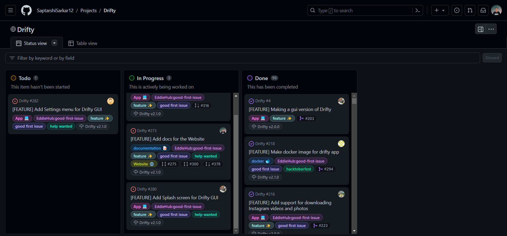

# Contributing for the first time? We've got you covered

Thank you for considering and taking the time to contribute! The following are the guidelines for contributing to this project

## Code of Conduct

We have a [Code of Conduct](https://github.com/SaptarshiSarkar12/Drifty/blob/master/CODE_OF_CONDUCT.md) that all contributors must follow. This code of conduct outlines our expectations for participants within the project and also steps to report unacceptable behavior. We are committed to providing a welcoming and inspiring community for all and expect our code of conduct to be honored. Anyone who violates or has concerns about the code of conduct should report it directly to the project maintainers.

## How to Report Bugs and Issues

To report any bugs or any difficulties you are facing, you can create an issue by following the below steps 👇

1. Go to the [issues](https://github.com/SaptarshiSarkar12/Drifty/issues) tab of the drifty project on GitHub
2. Click on the [new issue](https://github.com/SaptarshiSarkar12/Drifty/issues/new/choose) button
3. Choose the relevant category of the issue which you would like to raise
4. Provide as much information as possible, including screenshots, text output, and both your expected and actual results.

## What does each Issue Category mean?

1. **Bug Report for Application**
   You can create a **Bug Report for Application** to report any bug related to the application, including installation problems and crashes.
2. **Bug report for Website** 
    You can create an issue in this category if you encounter any bugs or issues in the [official website of Drifty](https://saptarshisarkar12.github.io/Drifty/).
3. **Documentation Change Request**
    Raise an issue if you think any improvements can be made in the Documentation of Drifty.
4. **Feature Request for Drifty Application**
    If you have any ideas to improve the application by adding new features, you can create an issue in this category.
5. **Feature Request for Drifty Website**
    If you have any ideas to improve the Website of Drifty by adding new features, you can create an issue in this category.

If none of the above categories applies to your case, feel free to create an issue in the **Others** category.


## Pull Requests

[Pull requests](https://github.com/SaptarshiSarkar12/Drifty/pulls) are a great way to implement your ideas into this project via relevant code changes. It is necessary to open an issue at first, describing the changes you want to make and discuss them with the maintainers. Once the issue gets assigned to you, you can open a pull request.

## What does each Label mean in Issues and Pull Requests?

1. **App 💻**
    This label indicates that changes are made in the Application code
2. **bug 🐛**
    This label indicates that changes are made to fix a bug
3. **dependencies 📦️**
    This label indicates that dependencies are updated in a Pull Request
4. **docker 🐋**
    This label indicates that changes are made in the Dockerfiles
5. **documentation 📝**
    This label indicates that changes are made in the documentation
6. **good first issue**
    This label indicates that the issue is suitable for beginners to start contributing
7. **help wanted**
    This label indicates that the issue requires help from the community
8. **invalid**
   This label is used to mark an issue or Pull Request as invalid, meaning it does not meet the project's guidelines or is not relevant to the project's goals.
9. **CI/CD 🔁**
    This label indicates that changes are made in the CI/CD workflows (GitHub Actions)
10. **duplicate**
     This label indicates that the issue / Pull Request is duplicate
11. **hacktoberfest**
     This label indicates that the issue is a part of [Hacktoberfest](https://hacktoberfest.com/)
12. **hacktoberfest-accepted**
     This label indicates that the Pull Request is accepted for [Hacktoberfest](https://hacktoberfest.com/) and will count towards your participation

## Project Insights: Status and Task Progress

[Projects Tab](https://github.com/users/SaptarshiSarkar12/projects/3) lists the tasks completed, in progress and the ideas left to be incorporated in the project. You can work on the **todo tasks** by creating the issue (if not already created) and getting yourself assigned.



## Running the Project in IntelliJ IDEA

#### Prerequisites

- [Java 21](https://www.oracle.com/java/technologies/downloads/#java21)
- [Download](https://maven.apache.org/download.cgi#previous-stable-3-8-x-release) and [install](https://maven.apache.org/install.html) **Maven** (Maven v3.8.8 is required for building installer or executable binaries for Drifty GUI, locally)
- [IntelliJ IDEA](https://www.jetbrains.com/idea/) (Recommended)

#### Steps

1. Clone the repository
   ```bash
   git clone git@github.com:SaptarshiSarkar12/Drifty.git
   ```
   You'll need to replace `SaptarshiSarkar12` with your GitHub username if you have forked the repository.
2. Open the project in IntelliJ IDEA
3. Follow the below steps to run the project:
   - Open the `Drifty_CLI` java class in `CLI/src/main/java/main` directory and run the project. This will start the CLI application.
   - Open the `Drifty_GUI` java class in `GUI/src/main/java/main` directory and run the project. This will start the GUI application.

## Building Installer or Executable Binaries for Drifty

### Local Build

#### Prerequisites

- [Java 21](https://www.oracle.com/java/technologies/downloads/#java21)
- [Download](https://maven.apache.org/download.cgi#previous-stable-3-8-x-release) and [install](https://maven.apache.org/install.html) **Maven** (Maven v3.8.8 is required for building installer or executable binaries for Drifty GUI, locally)
- [GraalVM](https://www.graalvm.org/downloads/) (Optional but required for building executable binaries locally)
- [GCC](https://gcc.gnu.org/install/) (Optional but required for building executable binaries for Drifty GUI, locally)

#### Steps

1. Open the terminal and navigate to the project directory
2. Run the below command to install the jar files in the local maven repository
   ```shell
   mvn clean install
   ```
3. For Drifty GUI only, you need to build a C object file by running the below command
   - For Linux,
     ```shell
     gcc -c config/missing_symbols.c -o config/missing_symbols-ubuntu-latest.o
     ```
   - For Windows,
     ```shell
     gcc -c config/missing_symbols.c -o config/missing_symbols-windows-latest.o
     ```
   - For Mac,
     ```shell
        gcc -c config/missing_symbols.c -o config/missing_symbols-macos-latest.o
     ```
   Replace `gcc` with the path to the GCC compiler if it is not in the system path.
4. Run the below command to build the installer or executable binaries
   - For GUI,
      - For Linux,
        ```shell
        mvn -P build-drifty-gui-for-ubuntu-latest gluonfx:build gluonfx:package -rf :GUI -U
        ```
      - For Windows,
        ```shell
        mvn -P build-drifty-gui-for-windows-latest gluonfx:build gluonfx:package -rf :GUI -U
        ```
      - For Mac,
        ```shell
        mvn -P build-drifty-gui-for-macos-latest gluonfx:build gluonfx:package -rf :GUI -U
        ```
   - For CLI,
       - For Linux,
         ```shell
         mvn -P build-drifty-cli-for-ubuntu-latest package
         ```
       - For Windows,
         ```shell
         mvn -P build-drifty-cli-for-windows-latest package
         ```
       - For Mac,
         ```shell
         mvn -P build-drifty-cli-for-macos-latest package
         ```
5. Upon completion of the build, the installer or executable binaries will be neatly organized in the directories listed below. The placeholder `{arch}` should be replaced with either `x86_64` or `aarch64`, depending on your system's architecture.
    - For GUI,
      - For Linux,
        ```shell
        GUI/target/gluonfx/{arch}-linux
        ```
      - For Windows,
        ```shell
        GUI/target/gluonfx/{arch}-windows
        ```
      - For Mac,
        ```shell
        GUI/target/gluonfx/{arch}-mac
        ```
    - For CLI,
      - For Linux,
        ```shell
        CLI/target/CLI/linux
        ```
      - For Windows,
        ```shell
        CLI/target/CLI/windows
        ```
      - For Mac,
        ```shell
        CLI/target/CLI/mac
        ```
6. You can now run the installer or executable binaries to use the application.
7. To remove the generated files, run the below command
   ```shell
   mvn clean
   ```

## Docker Compose

