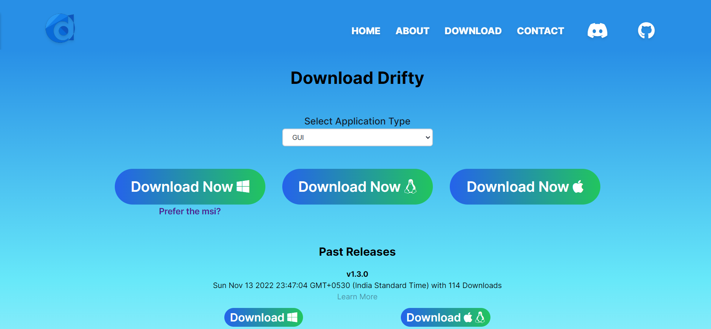
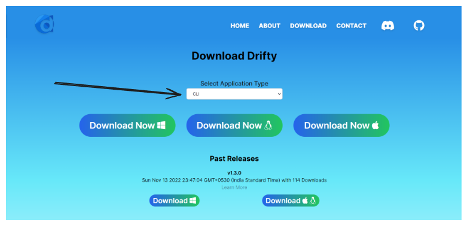

# Contributing for the first time? We've got you covered

Thank you for considering and taking the time to contribute! The following are the guidelines for contributing to this project

## How to Report Bugs and Issues

In order to report any bugs or any difficulties which you face which you would like to solve for this project, check out the steps how to reproduce 👇

1. Go to the [issues](https://github.com/SaptarshiSarkar12/Drifty/issues) tab of the drifty project on GitHub
2. Click on the [new issue](https://github.com/SaptarshiSarkar12/Drifty/issues/new/choose) button
3. Choose any of the following types of issue which you would like to raise
4. Then provide as much information as possible, including screenshots, text output, and both your expected and actual results.

## What does each Issue Category mean?

1. **Bug Report for Application**
   You can create a **Bug Report for Application** to report any bug related to the application including installation problems and crashes.
2. **Bug report for Website** 
    You can also raise issues related to the project's official website incase you encounter any bugs or issues.
3. **Documentation Change Request**
    Raise a request for a change in the official documentation of the drifty project.
4. **Feature Request for Drifty Applicaiton**
    If you have any new features which you think can improve the application in any way, then you can raise a request for that as well.
5. **Feature Request for Drifty Website**
    If you have any new features which you think can improve the project's official website in any way, then you can raise a request for that as well.

If you have anything else related to the project, you can select the others issue as well.

## Pull Requests

[Pull requests](https://github.com/SaptarshiSarkar12/Drifty/pulls) are a great way to get your ideas (through code changes) into this project. Please open an issue at first, describing the changes you want to make, then feel free to open a PR (Pull Request).

## What does each PR Label mean?

1. **App💻**
    This label is for bugs/features/pulls regarding the application
2. **bug🪱**
    This label is used to mark a PR when something isn't working or some bug is getting solved
3. **dependencies🥡**
    This label is for issues/pull requests that update the applcations internal or external dependencies
4. **docker🐋**
    This label is used as an indication for the issues working on docker images / docker files
5. **documentation📝**
    Indicates improvements or additions to the official docuementations
6. ****

## Checkout Projects

[Projects](https://github.com/users/SaptarshiSarkar12/projects/3) lists the tasks completed, in progress and the ideas left to be incorporated in the project. You can work on the To-Do tasks by creating the issue (if not present) and getting yourself assigned.

# Installation of Drifty

## Local Development

Go the the download link of dirfty and download the preferred distribution which you would like to install on your system

https://saptarshisarkar12.github.io/Drifty/download

## CLI Development

For downloading Drifty as a Command Line Interface (CLI) just select the CLI from the dropdown 

