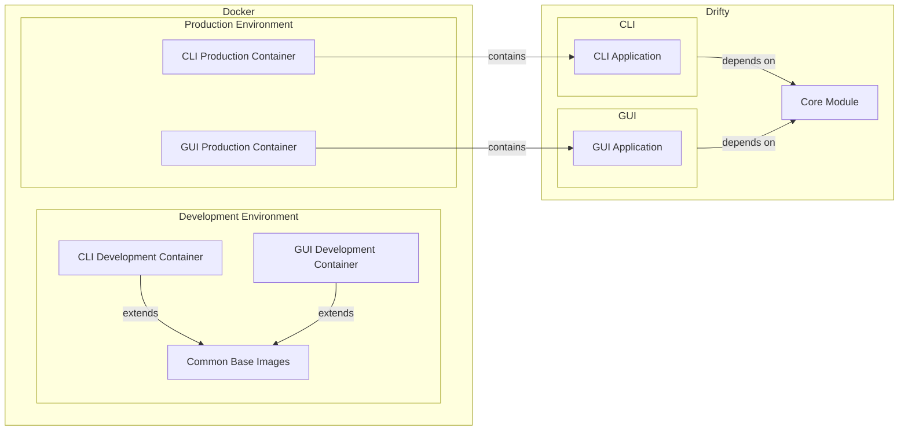

# Architecture

## Introduction

Drifty is an open-source file downloader system designed to be user-friendly, fast, and versatile. This document explains how Drifty is structured and the technologies it uses, helping both users and developers understand the project better.

## Project Structure

The project is organized into several key directories, each with a specific purpose:

- [`.github`](https://github.com/SaptarshiSarkar12/Drifty/tree/master/.github): GitHub-specific files including workflows, templates, and configurations
- [`CLI`](https://github.com/SaptarshiSarkar12/Drifty/tree/master/CLI): Command-line interface application code
- [`GUI`](https://github.com/SaptarshiSarkar12/Drifty/tree/master/GUI): Graphical user interface application code
- [`Core`](https://github.com/SaptarshiSarkar12/Drifty/tree/master/Core): Shared code used by both CLI and GUI applications
- [`Website`](https://github.com/SaptarshiSarkar12/Drifty/tree/master/Website): Documentation website built with Next.js
- [`website_redirection`](https://github.com/SaptarshiSarkar12/Drifty/tree/master/website_redirection): Redirection page for [the old Drifty website](https://saptarshisarkar12.github.io/Drifty/)
- [`config`](https://github.com/SaptarshiSarkar12/Drifty/tree/master/config): Configuration files for building installers and executables
- [`Docker`](https://github.com/SaptarshiSarkar12/Drifty/tree/master/Docker): Docker container configurations
  - [`dev`](https://github.com/SaptarshiSarkar12/Drifty/tree/master/Docker/dev): Development environment containers
    - [`CLI`](https://github.com/SaptarshiSarkar12/Drifty/tree/master/Docker/dev/CLI): CLI development container
    - [`GUI`](https://github.com/SaptarshiSarkar12/Drifty/tree/master/Docker/dev/GUI): GUI development container
    - [`commons`](https://github.com/SaptarshiSarkar12/Drifty/tree/master/Docker/dev/commons): Shared base images
  - [`prod`](https://github.com/SaptarshiSarkar12/Drifty/tree/master/Docker/prod): Production-ready containers
    - [`CLI`](https://github.com/SaptarshiSarkar12/Drifty/tree/master/Docker/prod/CLI): CLI production container
    - [`GUI`](https://github.com/SaptarshiSarkar12/Drifty/tree/master/Docker/prod/GUI): GUI production container

## Architecture Overview

Drifty's architecture is designed to be modular and flexible, allowing for easy development and deployment. The main parts are:

This diagram illustrates the relationships between the different components of Drifty:
- **Core Module**: Contains shared code used by both CLI and GUI applications
- **CLI and GUI Applications**: Independent applications that depend on the Core module
- **Docker Containers**: Built in layers, with development containers extending common base images and production containers containing the final applications

## Technologies Used

Drifty uses a variety of technologies to provide a robust and efficient downloading experience. Here's a breakdown of the key technologies:

### Core Technologies
- [**Java**](https://www.java.com/): The main programming language that powers Drifty's functionality
- [**JavaFX**](https://openjfx.io/): Framework for building the GUI application, providing a rich user interface
- [**Maven**](https://maven.apache.org/): Build automation tool that manages dependencies and builds the project

### Build & Development
- [**GraalVM**](https://www.graalvm.org/): High-performance runtime that allows Drifty to be compiled into native images for faster startup and lower memory usage
- [**GluonFX Maven Plugin**](https://github.com/gluonhq/gluonfx-maven-plugin): Plugin that simplifies building JavaFX applications for multiple platforms
- [**Docker**](https://www.docker.com/): Containerization platform that packages Drifty into portable containers for easy deployment

### Website
- [**Next.js**](https://nextjs.org/): Modern framework for building the documentation website
- [**Tailwind CSS**](https://tailwindcss.com/): Styling system that makes the website look good
- [**Nextra**](https://nextra.site/): Documentation framework that simplifies writing and managing documentation content

### DevOps
- [**GitHub Actions**](https://docs.github.com/en/actions): Continuous integration and deployment (CI/CD) tool that automates testing, building, and releasing Drifty
- [**GitHub Packages**](https://docs.github.com/en/packages): Package registry for storing and distributing Drifty's Docker images